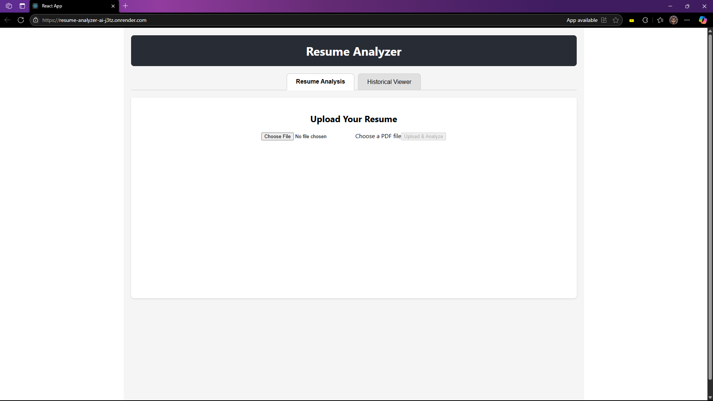
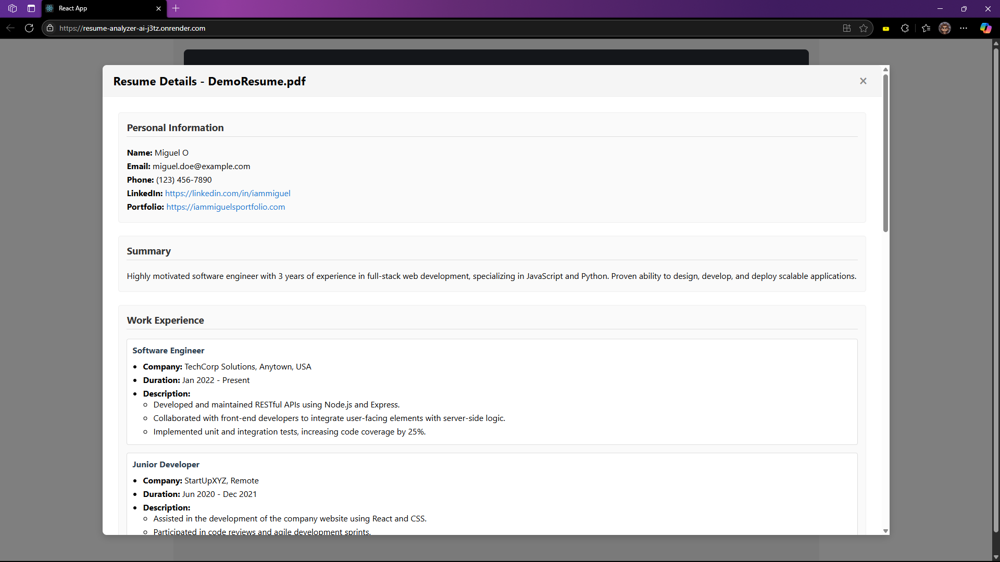

# Resume Analyzer

This application allows users to upload PDF resumes. It automatically extracts key information, stores it in a database, and provides AI-driven feedback for resume improvement using the Google Gemini LLM.

## Features

*   **Resume Analysis (Tab 1):**
    *   Upload a PDF resume.
    *   Backend extracts text from the PDF.
    *   Text is sent to the Google Gemini LLM via a specific prompt to extract structured data (contact info, skills, experience, summary, etc.) and generate analysis (rating, improvement areas, upskilling suggestions).
    *   Extracted data and AI analysis are saved to a PostgreSQL database.
    *   Results are displayed in a structured UI.
*   **Historical Viewer (Tab 2):**
    *   Displays a table of all previously uploaded resumes with key details.
    *   Includes a "Details" button per resume to view the full analysis and extracted data in a modal, reusing the UI from Tab 1.

## Technology Stack

*   **Frontend:** React.js
*   **Backend:** Node.js with Express.js
*   **Database:** PostgreSQL
*   **API Style:** REST API
*   **LLM Integration:** Google Gemini API (`@google/generative-ai` SDK)
*   **PDF Parsing:** `pdf-parse` (Node.js library)

## Architecture & Data Flow

1.  User uploads a PDF resume via the React frontend.
2.  The frontend sends the file to a specific endpoint on the Node.js backend.
3.  The backend uses `pdf-parse` to extract the raw text from the document.
4.  This raw text is embedded into a carefully engineered prompt, which is sent to the Google Gemini LLM.
5.  Gemini processes the prompt and returns a structured JSON object containing the extracted information and AI-generated analysis.
6.  The backend validates and saves this structured data into a PostgreSQL database.
7.  The JSON object is sent back to the frontend as the API response.
8.  The frontend renders this data in a user-friendly, organized layout.
9.  Tab 2 fetches stored data from the database via the backend API to display history.

## Implementation Highlights

*   **Backend (Node.js/Express):**
    *   Modular structure with separate directories for routes, controllers, and services.
    *   Uses `multer` for handling PDF file uploads.
    *   Integrates with PostgreSQL database using `pg` library, utilizing `JSONB` fields for storing complex extracted data.
    *   Implements robust error handling for file processing, LLM interaction, and database operations.
*   **Frontend (React):**
    *   Component-based architecture with dedicated components for uploading, displaying analysis, and viewing history.
    *   Uses `axios` for making API calls to the backend.
    *   Implements tab navigation for switching between analysis and history views.
    *   Features a modal for displaying detailed resume information.
*   **LLM Integration:**
    *   Careful prompt engineering is used to instruct the Google Gemini model to return consistently structured JSON data based on the resume content.

## Examples

    Landing Page
    

    History Page
    

## Deployment

This application is designed for deployment on platforms that support Node.js. The backend is configured to serve the built React frontend as static files. Environment variables are used for configuration (database credentials, API keys) and should be managed through the deployment platform's settings, not committed to the code repository.

* live at [Resume analyzer AI](https://resume-analyzer-ai-j3tz.onrender.com/)
