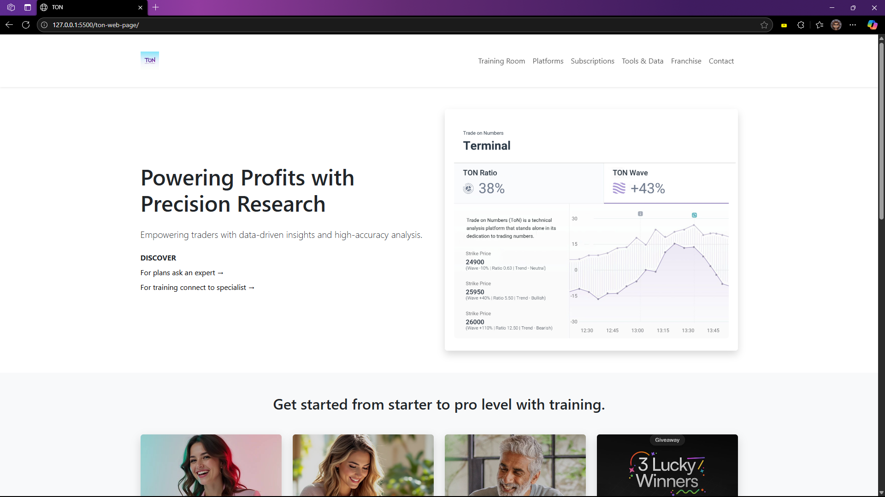

# TON Web Page Replication

This project is a front-end implementation of the "TON Web Page" design, built to be fully responsive and visually accurate across devices. The goal was to achieve a pixel-perfect replication using modern web technologies with a strong emphasis on clean structure, responsive layout, and design fidelity.

## 🎯 Objective

Recreate the provided "TON Web Page" design as a static, responsive webpage that closely matches the reference image in terms of:
- Layout and visual hierarchy
- Typography, colors, and spacing
- Responsive behavior on desktop and mobile
- Overall user interface aesthetics

## 🛠️ Tech Stack

- **HTML5** – For semantic and accessible page structure
- **CSS3** – For custom styling, animations, and fine-tuned visual adjustments
- **Bootstrap 5** – For responsive grid system, utility classes, and component styling

## 📐 Features

- **Fully Responsive Design**: Adapts seamlessly to desktop, tablet, and mobile screens using Bootstrap’s grid and responsive utilities.
- **Pixel-Perfect UI**: Careful attention to font sizes, weights, colors, margins, and alignment to match the reference image.
- **Modern Layout**: Clean sections including a sticky navbar, hero, training cards, insights, stats, and an elegant footer.
- **Optimized for Performance**: Lightweight assets and efficient CSS for fast loading.

## 📸 Preview

*(Note: Screenshot shows desktop and mobile views of the replicated design.)*

## 🧩 Custom Styling Highlights

While Bootstrap provides the structural foundation, custom CSS was used to:
- Match exact font sizes, line heights, and text colors
- Style buttons and cards to align with the design
- Add subtle shadows, rounded corners, and hover effects
- Fine-tune spacing and alignment where Bootstrap defaults needed adjustment

